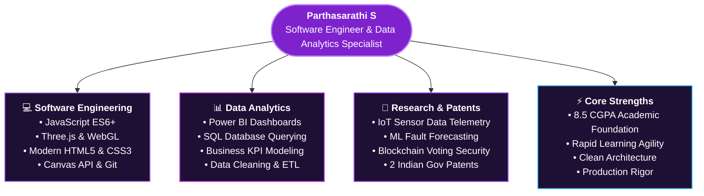

<div align="center">

# 🌌 Parthasarathi S | Software Engineer & Data Analytics Enthusiast

### *High-Performance Front-End Architecture • 3D WebGL Experiences • Data-Driven Solutions*

[](https://partha-portfolio-iq0m.onrender.com)
[](https://www.linkedin.com/in/parthasarathi-s-790421330)
[](#-academic-profile)
[](#-academic-profile)
[](#-intellectual-property--patents)

<br/>

[](https://www.linkedin.com/in/parthasarathi-s-790421330)
[](https://1drv.ms/w/c/656E31A6232AA852/IQBtmapv_KPNRI-d-mmNrPjnAbqyDSt3W6D5QSoJNbyWmwI?e=smnxth&download=1)
[](https://drive.google.com/drive/folders/1TZBwlyIL4JqH47GtuWHXhf0XudC3hNF5)
[](https://leetcode.com/u/parthasarathi6/)
[](https://www.hackerrank.com/profile/parthasarathi301)

<br/>

> ### 🌐 [**Click Here to Experience Live Portfolio Website**](https://partha-portfolio-iq0m.onrender.com)
> **Live Demo URL:** `https://partha-portfolio-iq0m.onrender.com`
> *Experience the Supernova Particle Entrance Portal, Living Wave Typography, and Interactive 3D Three.js Universe.*

<br/>

> *"Bridging computer science fundamentals with immersive, production-grade front-end engineering and actionable data analytics."*

</div>

---

## 👔 Executive Summary for Talent Acquisition & Hiring Managers

Hello and welcome! I am **Parthasarathi S**, a final-year **Computer Science and Engineering** undergraduate maintaining an **8.5 CGPA**, with **2 published Indian Government Patents** in Machine Learning, IoT, and Blockchain systems.

This repository hosts my modernized, futuristic developer portfolio featuring a **Supernova particle entrance portal** and an interactive **3D Three.js universe**, built entirely with **Vanilla JavaScript (ES6+), WebGL, HTML5, and CSS3** without relying on external frontend frameworks.

### 💡 Why Consider Me for Your Engineering Team?

| Quality | What It Means for Your Organization |
| :--- | :--- |
| ⚡ **Core Engineering Fundamentals** | Built 60 FPS 3D WebGL particle simulations, custom math-driven physics, and responsive layouts using pure Vanilla JS. Demonstrates deep grasp of the DOM, browser performance, and native APIs. |
| 📜 **Proven Innovation & R&D Mindset** | Authored and published **2 Government of India Patents** solving real-world challenges in hardware predictive maintenance and election fraud prevention. |
| 📊 **Dual-Domain Strength** | Proficient in both modern **Software Engineering** (JavaScript, UI/UX architecture, responsive design) and **Data Analytics** (Power BI dashboarding, SQL, data modeling). |
| 🚀 **High Velocity & Execution Rigor** | Strong problem-solving aptitude demonstrated across LeetCode, HackerRank, and full-lifecycle project builds from concept to deployment. |

---

## 🎯 Key Competencies & Architecture



### 🛠️ Detailed Technical Arsenal

| Category | Technologies & Tools |
| :--- | :--- |
| **Front-End & 3D Graphics** | JavaScript (ES6+), Three.js, HTML5 Canvas API, WebGL, CSS3, Flexbox/Grid, Responsive Architecture |
| **Data Analytics & BI** | Power BI, SQL, Microsoft Excel (Advanced), Data Visualization, Business Metrics, KPI Tracking |
| **Computer Science Core** | Data Structures & Algorithms, Object-Oriented Programming, Database Management Systems (DBMS), Operating Systems |
| **Tools & Deployment** | Git, GitHub, Render, VS Code, PowerShell, Node.js Tooling |
| **Competitive Coding** | [LeetCode](https://leetcode.com/u/parthasarathi6/) • [HackerRank](https://www.hackerrank.com/profile/parthasarathi301) |

---

## 📜 Intellectual Property & Patents

Demonstrating innovation beyond classroom coursework, I have co-invented and published **2 official patents** registered with the Indian Patent Office:

### 1. ⚙️ Fault Prediction in Computer using IoT and Machine Learning
* **Application Number**: `202541129936 A`
* **Publication Date**: February 2025
* **Domain**: Internet of Things (IoT) • Predictive Maintenance • Machine Learning
* **Impact**: An automated early-warning telemetry system that monitors real-time CPU thermals, memory pressure, and system voltage via IoT sensors to forecast computer hardware breakdowns before system downtime occurs.

### 2. 🛡️ Fraud Detection in Voting System using Blockchain & Machine Learning
* **Application Number**: `202541037560 A`
* **Publication Date**: January 2025
* **Domain**: Distributed Ledger Technology (Blockchain) • Fraud Detection • Cyber Security
* **Impact**: A tamper-evident cryptographic voting protocol that combines immutable blockchain transaction records with ML anomaly detection algorithms to identify and nullify duplicate or unauthorized votes in real time.

---

## 🌟 Featured Engineering Projects

### 1. 🌌 Futuristic 3D Developer Portfolio & Universe Engine
* **Live Demo**: [partha-portfolio-iq0m.onrender.com](https://partha-portfolio-iq0m.onrender.com)
* **Tech Stack**: Vanilla JavaScript (ES6+), Three.js, Canvas API, CSS3 Glassmorphism
* **Architectural Highlights**:
  * **Supernova Sparkle Entrance**: Custom particle engine that executes a 360-degree supernova explosion across the full screen, converging into stabilized living wave typography without layout shift.
  * **3D Spherical Particle Universe**: Thousands of reactive points with orbital rings and dynamic camera sync keyed to user scroll depth.
  * **Interactive Custom Cursor**: Reactive neon heart pointer companion that tracks user velocity with zero page-load pop-in.
  * **Continuous Live Typewriter Engine**: Custom character-by-character typewriter simulator for patent abstracts.

### 2. 🏦 Bank Management Application
* **Domain**: Software Engineering • Financial Systems • Business Logic
* **Highlights**: Comprehensive account management system featuring secure credential authentication, automated balance ledgers, transaction verification, and robust input validation.
* **Source Code**: [GitHub Repository](https://github.com/parthasarathi3004)

### 3. 🧮 Interactive Calculator Application
* **Domain**: Front-End Engineering • UI/UX Design
* **Highlights**: Clean, responsive calculator implementing mathematical expression parsing, state management, edge-case error handling, and tactile keyboard listener support.
* **Source Code**: [GitHub Repository](https://github.com/parthasarathi3004)

### 4. 📊 Enterprise Power BI Analytics Dashboards
* **Domain**: Business Intelligence • Data Analytics • Decision Support
* **Dashboards Built**:
  * **Customer Churn Analysis**: Multi-variable cohort retention rates and churn risk prediction.
  * **Sales & Revenue Performance**: Executive KPI tracking, product revenue decomposition, and quarterly run-rate forecasts.
  * **Marketing Conversion Funnel**: Multi-channel acquisition ROI and cost-per-lead optimization metrics.

---

## 🎓 Academic Profile

* **Degree**: Bachelor of Engineering (B.E.) in Computer Science and Engineering
* **Graduation Year**: 2026 (Final Year)
* **Academic Performance**: **8.5 CGPA**
* **Core Coursework**: Data Structures & Algorithms, Design & Analysis of Algorithms, Database Management Systems, Object-Oriented Software Engineering, Computer Networks, Operating Systems, Machine Learning.

---

## 🚀 Quick Setup & Local Execution

To inspect the portfolio locally on your machine:

```bash
# 1. Clone the repository
git clone https://github.com/parthasarathi3004/Partha_portfolio.git

# 2. Navigate to project directory
cd Partha_portfolio

# 3. Start local development server (Zero dependencies required)
node server.js
```

Open your browser and navigate to:
```
http://localhost:3000
```

> Or visit the deployed cloud version directly at: [https://partha-portfolio-iq0m.onrender.com](https://partha-portfolio-iq0m.onrender.com)

---

## 📬 Direct Contact & Availability

I am actively interviewing for **Software Engineer**, **Associate Software Developer**, **Front-End Developer**, and **Data Analyst** roles.

<div align="center">

| Channel | Contact Details |
| :--- | :--- |
| 🚀 **Live Portfolio Demo** | [partha-portfolio-iq0m.onrender.com](https://partha-portfolio-iq0m.onrender.com) |
| 💼 **LinkedIn** | [linkedin.com/in/parthasarathi-s-790421330](https://www.linkedin.com/in/parthasarathi-s-790421330) |
| 🐙 **GitHub** | [github.com/parthasarathi3004](https://github.com/parthasarathi3004) |
| 💻 **LeetCode** | [leetcode.com/u/parthasarathi6/](https://leetcode.com/u/parthasarathi6/) |
| 🏆 **HackerRank** | [hackerrank.com/profile/parthasarathi301](https://www.hackerrank.com/profile/parthasarathi301) |
| 📄 **Direct Resume (DOCX)** | [Download Resume File](https://1drv.ms/w/c/656E31A6232AA852/IQBtmapv_KPNRI-d-mmNrPjnAbqyDSt3W6D5QSoJNbyWmwI?e=smnxth&download=1) |
| 📁 **Resume Folder** | [Google Drive Credentials](https://drive.google.com/drive/folders/1TZBwlyIL4JqH47GtuWHXhf0XudC3hNF5) |

<br/>

**Thank you for reviewing my profile. I look forward to contributing to your team's mission!**

</div>
